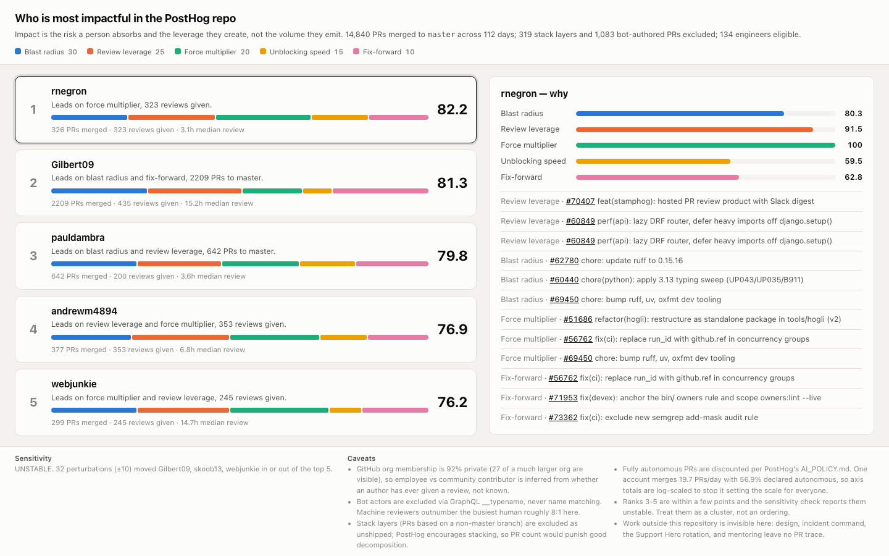

# Who is most impactful in the PostHog repo

**Live dashboard: https://deyashmukh.github.io/weave_th/**

An analysis of [PostHog/posthog](https://github.com/PostHog/posthog) that ranks the five
most impactful engineers and shows, per person, why. Built for a busy engineering leader
who will not open a single PR.



## What "impact" means here

**The risk a person absorbs and the leverage they create — not the volume they emit.**

Five axes, each log-scaled and normalised to 0–100, then combined by a weighted sum with
the per-axis breakdown visible on every card.

| Axis | Weight | Question |
|---|---:|---|
| Blast radius | 30 | How much *risk-weighted* change did they land on `master`? |
| Review leverage | 25 | Whose judgement does the codebase actually rely on? |
| Force multiplier | 20 | Did they change how everyone else — and every agent — works? |
| Unblocking speed | 15 | How much latency do they remove from other people's work? |
| Fix-forward | 10 | Who cleans up production, especially code they didn't write? |

Nothing here is a number I invented. The ×3 critical-path multiplier uses PostHog's own
`CODEOWNERS`, whose header calls adding an entry *"anti-social… requiring extraordinary
justification"* — which makes the ~15 surviving paths PostHog's own statement of where
blast radius is real. Cross-team reach resolves against the 26 distributed `owners.yaml`
files mapping paths to 33 teams.

## Why volume metrics fail on this repo specifically

Three corrections, each measured rather than assumed, and each changing the ranking:

| Correction | Measured |
|---|---|
| **Stack layers excluded** | 319 merged PRs target a non-`master` branch. `AGENTS.md` tells engineers to "stack instead of stuffing", so PR count punishes good decomposition |
| **Bots excluded** | 1,083 bot-authored PRs. Machine reviewers (`greptile-apps`, `stamphog`, `veria-ai`, Copilot, Codex…) outnumber the busiest human reviewer roughly **8:1**. Ranking "reviews given" naively puts Greptile first |
| **Agent authorship discounted** | The PR template requires an `Autonomy:` line. 9.9% of merged PRs declare *Fully autonomous* |

One account merges **19.7 PRs/day** with **56.9% declared fully autonomous**. Under plain
min-max scaling it alone set the anchor, pushing the median score of the other 133 eligible
engineers to **4.9/100**. Log scaling moves that median to **52.8** and widens the rank 3–5
separation tenfold. That correction was found by an independent review running the code
against real data, not by inspection.

## Results

Ranks 1–2 are clear. **Ranks 3–5 are a statistical cluster** — the sensitivity check
perturbs every weight ±10 across all 32 sign combinations and reports `stable=False`,
so the dashboard labels them as a tie and names who displaces them. A ranking that claims
more precision than the data supports is the failure mode that check exists to catch.

## Reproducing

```bash
uv sync
uv run python -m impact.fetch    # ~35 min; writes data/raw/prs.jsonl (86MB, git-ignored)
./build.sh                       # scores 15,159 PRs in ~33s, writes docs/index.html
```

Raw data is git-ignored; the ownership snapshot and scored output are committed, so
`./build.sh` works without re-fetching.

```bash
uv run pytest && uv run ruff check . && uv run mypy
```

## Limitations

- **GitHub org membership is 92% private** (27 visible of a much larger org), so employee
  vs community contributor is *inferred* from whether an author has ever given a review.
- **Coverage is guaranteed from 2026-04-28**, the `updatedAt` the pagination walk reached.
  Since GitHub guarantees `updatedAt >= mergedAt`, nothing merged after that can be missed.
  Cross-checked at 99.9% against GitHub's own count for the required 90-day window.
- **Work outside this repo is invisible**: design, incident command, the Support Hero
  rotation, mentoring.
- Reviews are capped at 30/PR and files at 60/PR; truncation is detectable and reported.

## Layout

| Path | |
|---|---|
| `src/impact/ownership.py` | `CODEOWNERS` + 26 `owners.yaml` → path→team, path→critical |
| `src/impact/classify.py` | Bots, stack layers, agent autonomy, conventional-commit parsing |
| `src/impact/axes.py` | The five scorers. Pure functions, no I/O |
| `src/impact/score.py` | Normalisation, eligibility, composite, sensitivity |
| `src/impact/render.py` | → one self-contained HTML file |
| `docs/superpowers/specs/` | Design spec, including what the review changed and why |
